# Python for Kids — Arcade Mini Projects

A collection of small, kid-friendly Python games and demos built with the Arcade library. Each script is self-contained and focuses on a simple concept: movement, animation, basic physics, or a small game loop challenge.

This repo is great for learning by tinkering: open a file, read the constants and comments, run it, then modify values to see what happens.

## Requirements

- macOS, Windows and Linux 
- Python 3.13+ 
- Arcade >= 3.3.2

## Quick start

1) Create and activate a virtual environment (recommended):

```bash
python3 -m venv .venv
source .venv/bin/activate
python -m pip install --upgrade pip
```

2) Install Arcade:

```bash
pip install "arcade>=3.3.2"
```

3) Run any script (examples):

```bash
python 00_template.py
python 13_maze.py
```

Assets are in `assets/`. Make sure you run commands from the repo root so the relative asset paths resolve.

## Testing

This repo includes headless unit tests using pytest. To run them:

```bash
pip install pytest
pytest -q
```

Notes:
- Tests that depend on Arcade will be skipped automatically if Arcade isn’t installed.
- To run all tests, install Arcade first:

```bash
pip install "arcade>=3.3.2"
```

## Assets & Attribution

- All third-party images are listed in `assets/attribution.txt` with source URLs and licenses where known.
- If you add or replace images, please update that file. Screenshots in `screenshots/` are generated from this repo and don’t require external attribution.

### How to capture screenshots

Take screenshots of your projects and share with your parents, friends, and with PyCodDIY! Let us make fun and celebrate together! 

- macOS:
	- Shift+Cmd+3 — capture the entire screen to a file
	- Shift+Cmd+4 — capture a selection:
		- Drag to select an area; release to save
		- Press Space after Shift+Cmd+4 to switch to window capture (click a window)
		- Hold Control to copy to clipboard instead of saving a file
		- Hold Option (⌥) to resize from center; hold Shift to constrain one axis
		- Press Esc to cancel
	- Shift+Cmd+5 — open the Screenshot toolbar:
		- Capture entire screen, a window, or a selection; also record screen
		- Options: choose save location (Desktop, Documents, Clipboard, etc.), timer, show/hide pointer, floating thumbnail
		- The “Options” menu controls where screenshots are saved by default
- Windows:
	- Win+Shift+S to open the snipping toolbar (copy to clipboard, then paste into an editor)
	- PrtScn to copy the full screen to the clipboard
	- Alt+PrtScn to copy the active window to the clipboard
	- Win+PrtScn to save a full-screen capture directly to Pictures\\Screenshots

## Examples

- 00 — Template: [docs/00_template.md](docs/00_template.md) 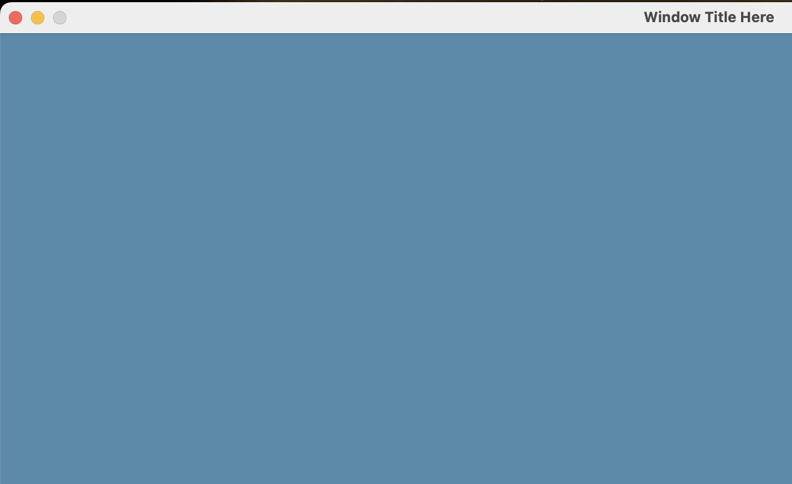
- 01 — Basic Drawing: [docs/01_basic_drawing.md](docs/01_basic_drawing.md) 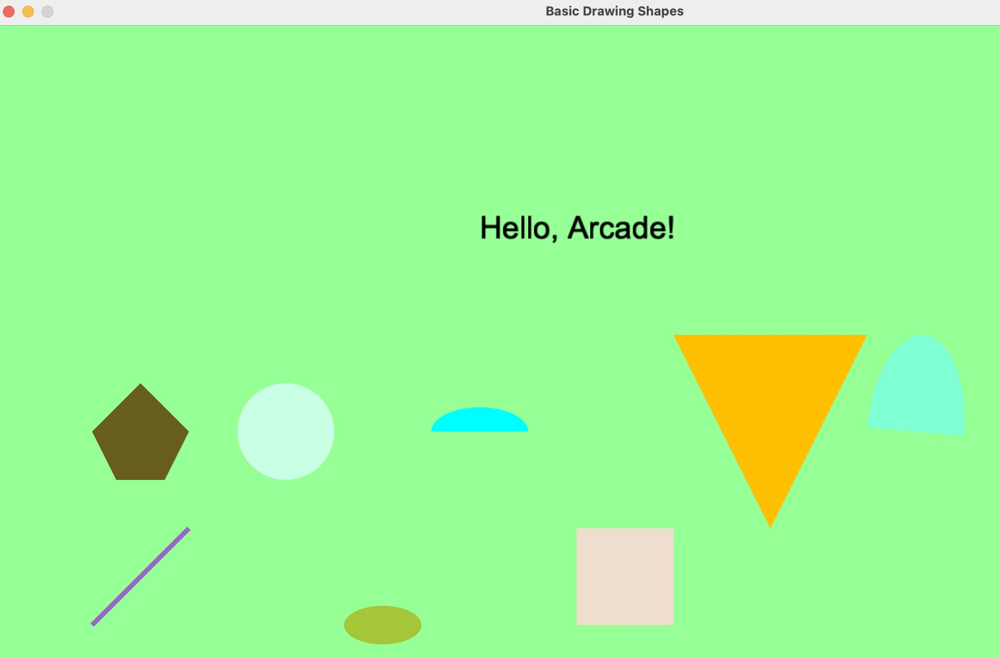
- 02 — Keyboard Control: [docs/02_keyboard_control.md](docs/02_keyboard_control.md) 
- 03 — Basic Movement: [docs/03_basic_movement.md](docs/03_basic_movement.md) 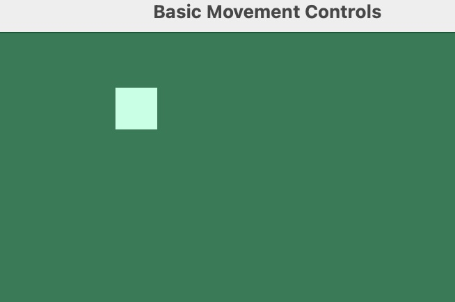
- 04 — Press & Release: [docs/04_press_release.md](docs/04_press_release.md) 
- 05 — Border Control: [docs/05_border_control.md](docs/05_border_control.md) 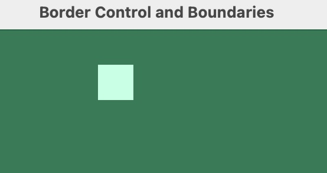
- 06 — Geometry Awareness (baseline): [docs/06_geometry_awareness.md](docs/06_geometry_awareness.md) 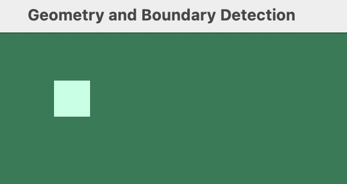
- 07 — Classes: [docs/07_classes.md](docs/07_classes.md) 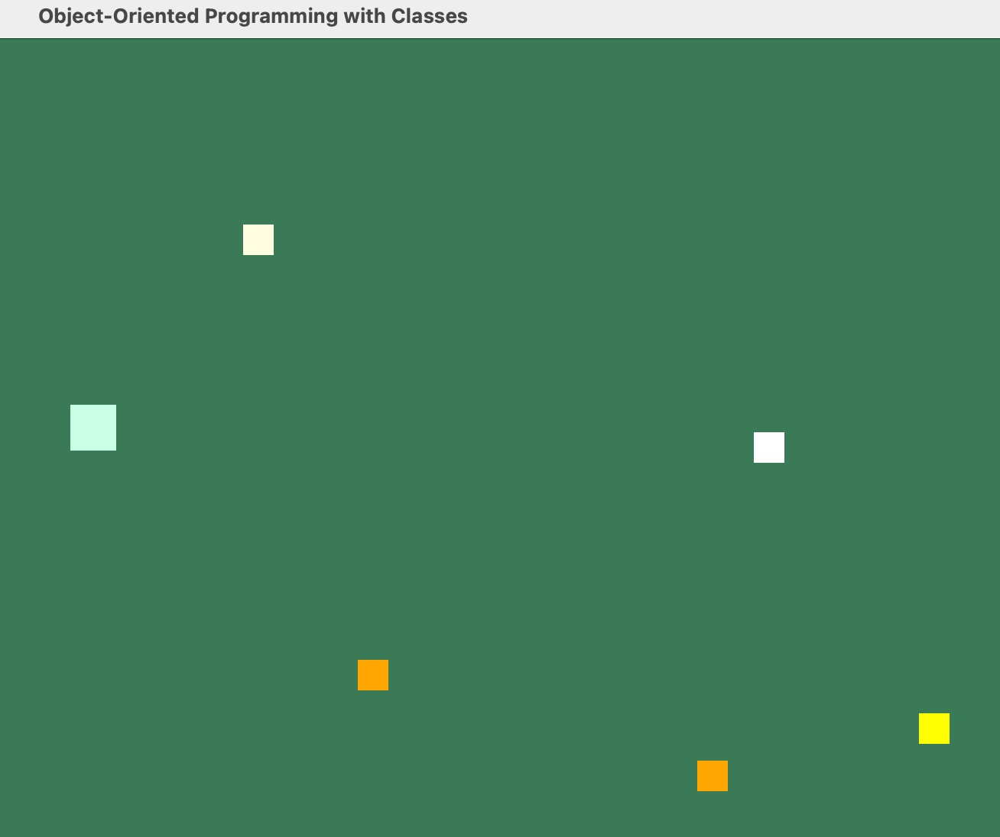
- 08 — Collision: [docs/08_collision.md](docs/08_collision.md) 
- 09 — Countdown: [docs/09_countdown.md](docs/09_countdown.md) 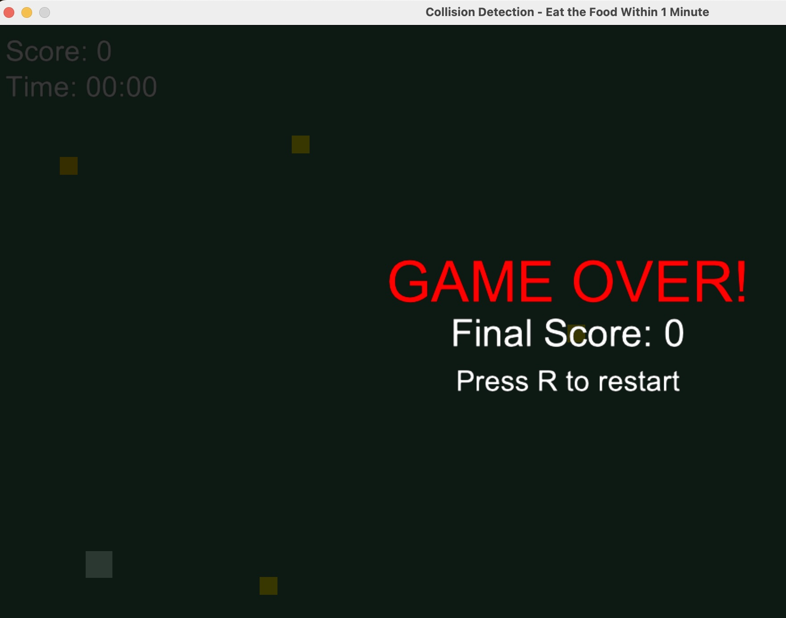
- 10 — Sprite Basics: [docs/10_sprite_basics.md](docs/10_sprite_basics.md) 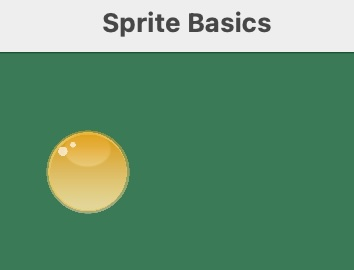
- 11 — Sprite Collision: [docs/11_sprite_collision.md](docs/11_sprite_collision.md) 
- 12 — Sprites + Countdown: [docs/12_sprites_countdown.md](docs/12_sprites_countdown.md) 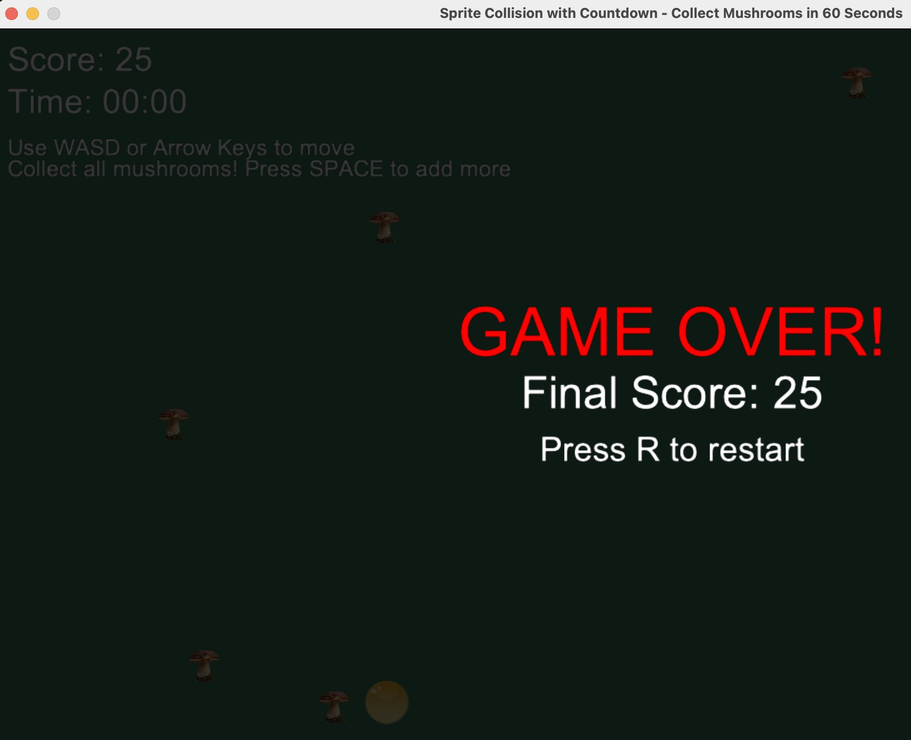
- 13 — Maze: [docs/13_maze.md](docs/13_maze.md) 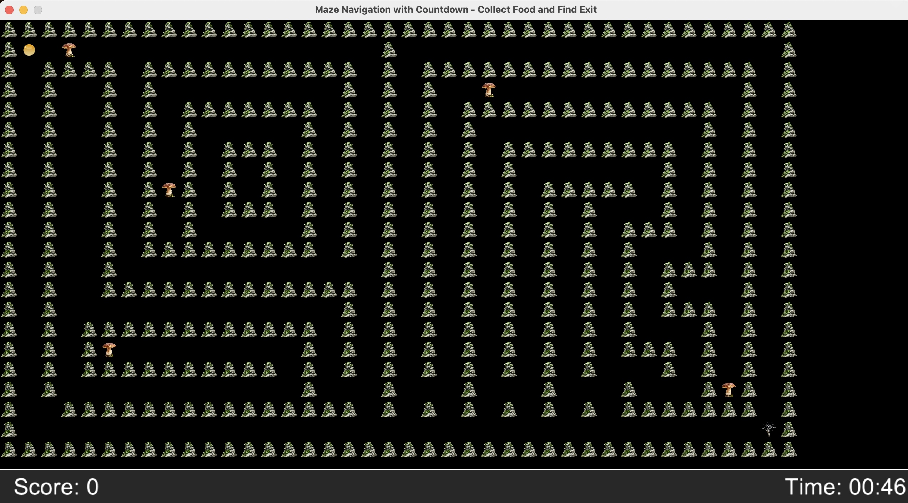
- 14 — Enemy: [docs/14_enemy.md](docs/14_enemy.md) 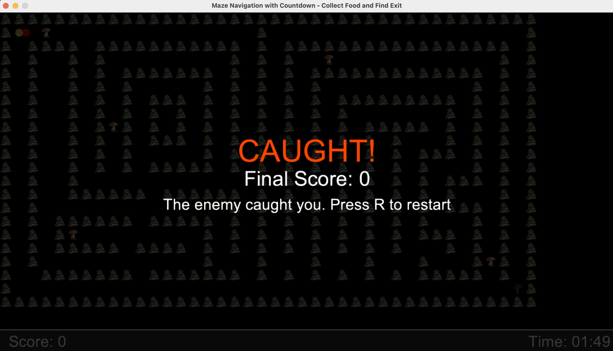
- 15 — Slime Animation: [docs/15_slime_animation.md](docs/15_slime_animation.md) 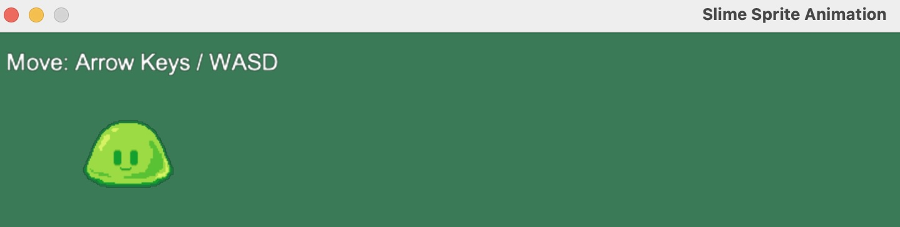
- 21 — G-Force (Gravity): [docs/21_gforce.md](docs/21_gforce.md) 
- 22 — Obstacle: [docs/22_obstacle.md](docs/22_obstacle.md) 
- 23 — Obstacle Spawning: [docs/23_obstacle_spawning.md](docs/23_obstacle_spawning.md) 

 