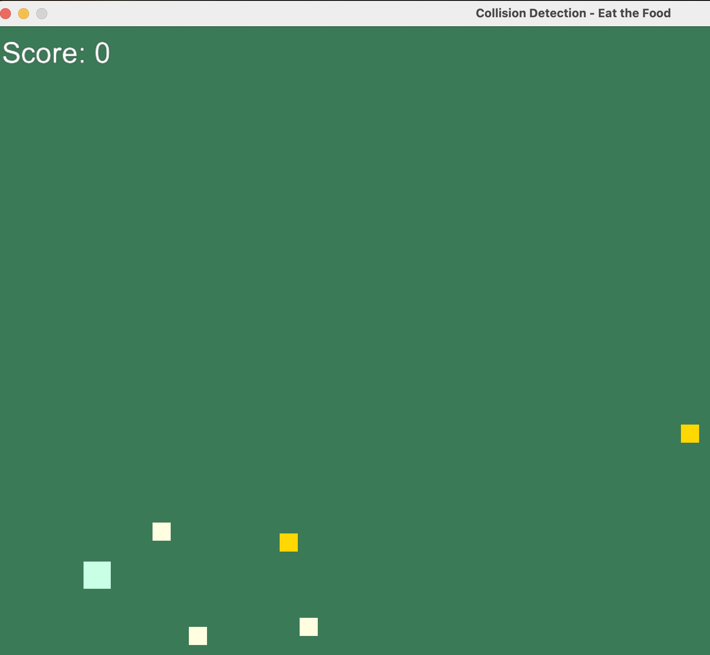

# 08 — Collision: Eat the Food (AABB with LBWH rectangles)



Script: `08_collision.py`

This example draws simple squares using
`arcade.draw_lbwh_rectangle_filled(x, y, width, height, color)` and checks
collisions using classic AABB math based on rectangle edges. The player is a
square you move with the keyboard; “food” squares are removed (eaten) on
collision and your score increases.

## Controls

- Move: Arrow keys or WASD
- Space: Spawn one new food square
- C: Clear all food
- R: Reset (score to 0, player back to start, food respawned)

## Run

```bash
python 08_collision.py
```

## How collision works here (edge-based AABB)

Because `draw_lbwh_rectangle_filled` uses the bottom-left corner as the origin,
we reason about rectangle edges (left/right/bottom/top) rather than centers. Two
axis-aligned rectangles overlap if they overlap on both X and Y axes:

```
char_left   = char.x
char_right  = char.x + char.size
char_bottom = char.y
char_top    = char.y + char.size

food_left   = food.x
food_right  = food.x + food.size
food_bottom = food.y
food_top    = food.y + food.size

collides = (
	char_left   < food_right and
	char_right  > food_left  and
	char_bottom < food_top   and
	char_top    > food_bottom
)
```

If `collides` is true, we remove that food from the list and increment the score.

## Concepts you’ll see in the code

- Drawing with `arcade.draw_lbwh_rectangle_filled` (LBWH = left, bottom, width, height)
- Edge-based AABB (Axis-Aligned Bounding Box) overlap test
- Basic input handling (track currently pressed key, move by a fixed step)
- Simple game state: a score counter and regenerating food when the list is empty

## Ideas to extend

- Randomize food sizes or colors (already partially done)
- Spawn waves of food as you reach certain scores
- Add walls (rectangles) and prevent the player from passing through them
- Replace squares with circles and switch to circle–rectangle tests
